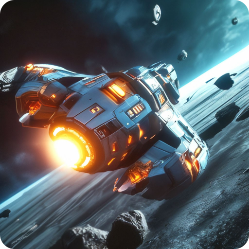

##  
 Истребитель Астероидов: Выживание 

---

## **Оглавление**

- [ Истребитель Астероидов: Выживание ](#-истребитель-астероидов-выживание-)
- [**Оглавление**](#оглавление)
  - [**Проект Истребитель Астероидов: Выживание**](#проект-истребитель-астероидов-выживание)
    - [**Технологии:**](#технологии)
  - [**Запуск проекта**](#запуск-проекта)
- [**Автор**](#автор)

---

### **Проект Истребитель Астероидов: Выживание**

["Истребитель Астероидов: Выживание"](https://yandex.ru/games/app/191697?utm_source=game_popup_menu) - игра, созданная в рамках учебного проекта для проверки возможностей игрового движка Godot в работе с HTML5. В этой игре вы выступаете в роли пилота космического корабля, который должен уничтожать астероиды, направляющиеся на Землю. Вам предстоит пройти через множество уровней и сражаться с различными видами астероидов, используя свои навыки пилотирования и стрельбы.

Управление в игре простое и интуитивно понятное. На ПК вы можете использовать клавиши W, A, D и SPACE для управления кораблем. На смартфонах вы можете использовать кнопки сенсорного экрана. Для аркад и симуляторов доступна реалистичная физика, что делает игру еще более захватывающей.

#### **Технологии:**

- 
- [instant-games-bridge-godot](https://github.com/instant-games-bridge/instant-games-bridge-godot)

---

### **Запуск проекта**

1. Перейти на страницу [проекта](https://yandex.ru/games/app/191697?utm_source=game_popup_menu)
2. Скачать и установить игровой движок [Godot 3.5](https://godotengine.org/download/3.x/)

## **Автор**

[Александр Андреевич](https://github.com/Zolibot)

